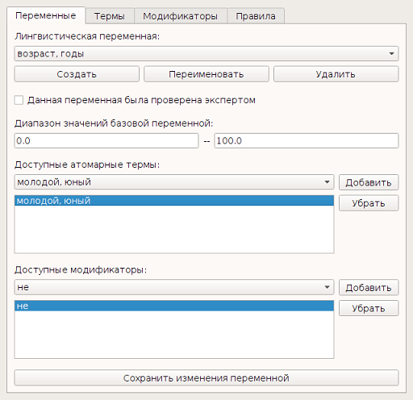
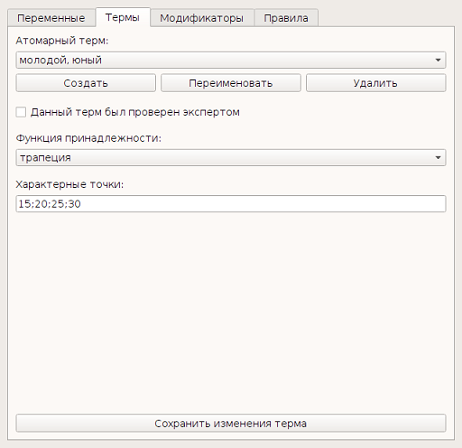
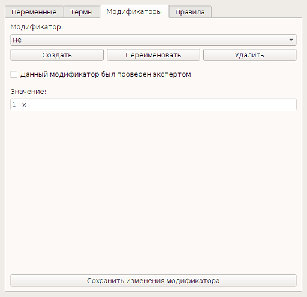
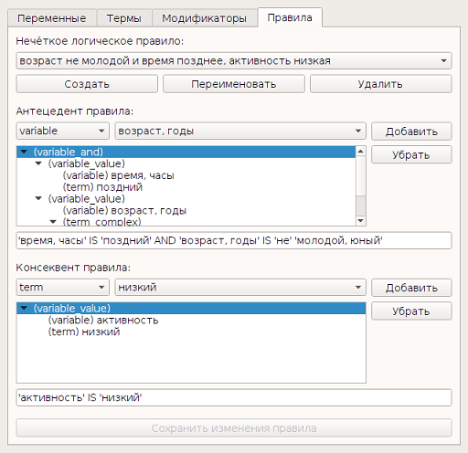

Графический интерфейс эксперта
==============================

На рисунке 1 изображѐн режим просмотра, модификации и создания лингвистических переменных. В этом режиме эксперт может задать диапазон значений универсального множества переменной и редактировать списки связанных с переменной атомарных термов и модификаторов. Информация о связанных с переменной термах и модификаторах необходима для редактора лингвистических правил. Как было указано выше, в роли идентификатора переменной выступает соответствующая группа синонимов. Именем переменной, отображаемым в интерфейсе эксперта, служит перечень наиболее часто употребляемых синонимов группы. Эксперт при желании может переименовать переменную.

Режим просмотра, модификации и создания атомарных термов изображѐн на рисунке 2. В этом режиме эксперт может задать для терма тип функции принадлежности и характерные точки. С именем терма дела обстоят аналогично таковому для переменных.

В режиме работы с модификаторами, изображѐнном на рисунке 3, эксперт может создать новый модификатор, удалить или переименовать существующий, задать создать новый модификатор, удалить или переименовать существующий, задать семантическую функцию модификатора.

На рисунке 4 изображѐн режим просмотра и редактирования лингвистических правил. Имя правила задаѐтся при его создании и также может быть изменено экспертом впоследствии. В соответствующих элементах интерфейса отображаются древовидные структуры антецедента и консеквента правила, представленные в базе знаний в виде деревьев разбора. Каждый узел описывается типом, указанным в скобках, и значением, если узел является терминальным (переменная, терм или модификатор). Выделенная часть дерева также транслируется в строчное представление в соответствующем поле. Любая из частей правила (антецедент или консеквент) могут быть модифицированы посредством добавления или удаления узлов дерева. Процесс модификации регламентируется грамматикой правил, описанной выше, с целью сохранения грамматической корректности правил. Так, например, при добавлении нового дочернего узла выбор типов добавляемого узла ограничивается допустимыми для выбранного родительского. При выборе в качестве типа добавляемого узла терма или модификатора список соответствующих идентификаторов ограничивается связанными с выбранной лингвистической переменной.

Все описанные выше режимы работы интерфейса эксперта согласованы между собой, то есть модификация терма или переменной в соответствующих режимах работы отражаются в режимах работы с переменными и правилами, модификация переменных – также в режиме работы с правилами. 
